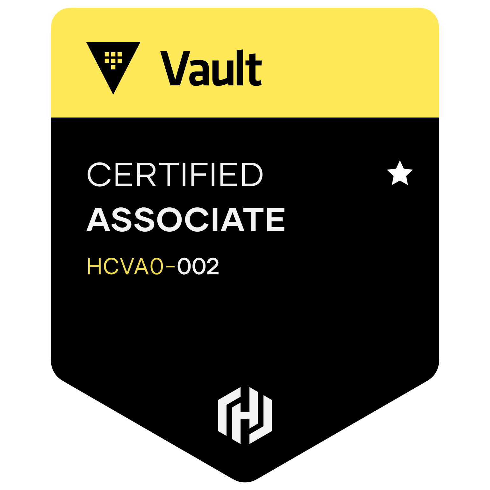

#  Vault Associate Certification
Information regarding the Vault Associate Certification

## Exam Objectives

* Compare authentication methods
* Create Vault policies
* Assess Vault tokens
* Manage Vault leases
* Compare and configure Vault secrets engines
* Utilize Vault CLI
* Utilize Vault UI
* Be aware of the Vault API
* Explain Vault architecture
* Explain encryption as a service

## What is Vault

* Manage secrets and protect sensitive data providing a single source of secrets for both humans and machines, also provides complete lifecycle management for secrets (usernames and passwords, API keys, certificates, encryption keys)

## Vault interfaces

* API
* UI 
* CLI

## Token Generation

1. [user, machine] Authentication on vault
2. [vault] Generate token
3. [user, machine] Retrieve data from a path

## Benefits

* Store Long-lived static secrets
* Dynamically generate secrets upon request
* Fully-featured API
* Identity-based access across different clouds and systems
* Provide Encryption as a service
* Act as a Root or intermediate certificate authority

> Centralize the storage of secrets across the organization into a consolidated platform

## Versions:

* Open Source: 
  * No replication capabilities
  * Does not include access to Enterprise integrations (MFA, HSM,Automated Backups)
* Enterprise:
  * Self-managed
* Vault on HCP (Hashicorp cloud platform)

## Vault Architecture

### Vault Components

* Storage Backends:
  * Configures location for storage of vault data.
  * Storage is defined in the main Vault configuration file with desired parameters
  * All data is encrypted in transit (TLS) and at-rest using AES256
  * Storage backend examples: S3, Consul, DynamoDB
  * there is only one storage backend per Vault cluster
* Secrets Engines:
  * Vault components tha are responsible for managing secrets for your organization.
  * Secrets engines can store, generate, or encrypt data.
  * Many secrets engines connect to other services to generate dynamic credentials on-demand
  * Many secrets engines can be enabled and used as needed (even multiple secrets engines of the same type)
  * Secret engines are enabled and isolated at a "path"
* Authentication Methods
  * Vault components that perform authentication and manage identities.
  * Multiple authentication methods can ve enabled depending on your use case
  * Once authenticated, Vault will issue a client token used to make all subsequent Vault requests, **the fundamental goal of all auth methods is to obtain a token**
  * Each token has an associated **policy** (or policies) and a **TTL**.
  Default authentication method for a new Vault deployment = tokens
* Audit Devices
  * Keeps detailed JSON log of all requests and responses to vault.
  * Sensitive information is hashed before logging.
  * Can (and should) have **more than one** audit device enabled (Vault **Prioritizes safety over availability)

### High Level Architecture

* HTTP/s API :arrow_right: Barrier :arrow_right: Vault Core (Token Store, Path Routing, secrets Engines, Systmen Backend, Auth Method, Audit device...) :arrow_right: Barrier :arrow_right: Storage Backend

### Vault Paths

* Everything in Vault is **path-based**
* The path prefix tell Vault which component a request should be routed.
* Secret engines, auth methods, and audit devices are  "mounted" at a specified path
* Paths available are dependent on the features enabled in Vault, such as Auth methods and secrets engines
* System backend is a default backend in Vault which is mmounted at the /sys endpoint
* Vault components can be enabled at ANY path you'd like using the -path flag (Each component have a default path)
* Vault has a few system reserved path which you cannot use or remove:
  * auth/
  * cubbyhole/
  * identity/
  * secret/
  * sys/

### Vault Data Protection

* Master Key:
  * used to decrypt the encryption key.
  * Created during Vault initialization or during a rekey operation
  * Never written to storage using traditional unseal mechanism
  * Written to core/master (storage backend) when using Auto Unseal
* Encryption Key:
  * Used to encrypt/decrypt data written to storage backend
  * Encrypted by the Master Key
  * Stored alongside the data in a keyring on the storage backend.
  * Can be easily rotated (manual operation)

### Seal and Unseal

* Vault stats in a **sealed state**, meaning it knows where to access the data, and how, but can't decrypt it (you can also manually seal it via UI, API, or CLI).
* Almost **no operations** are possible when Vault os on a sealed state (only status check and unsealing are possible)
* Unsealing Vault means that **a node can reconstruct the master key** in order to decrypt the encryption key, and ultimately and read the data
* After unsealing, the encryption key is stored in memory
* Sealing Vault means Vault "throws away" the encryption key and requires another unseal to perform any further operations.
* When would I seal Vault?
  * Key shards are inadvertently exposed.
  * Detection of a compromise or network intrusion.
  * Spyware/malware on the Vault nodes.
* Unseal Options:
  * Unsealing with key shards (Sharmir):
    * Default option for unsealing.
    * No single person should have access to all key shards
    * Ideally, each key shard should be stored by a different employee
    * When initializing Vault, you can request the individual shards to be encrypted with different PGP Keys
    * When unsealing Vault,yYou will need an equal number of employees to provide they key which is equal to the threshold
    * Key shards should not be stored online and shoul be highly protected - ideally stored encypted
  * Unsealing with Auto Unseal:
    * Uses a cloud service to protect our master key
    * Cloud Auto Unseal automatically unseals Vault upon service or node restart **without additional intervention**
    * Available in both open source & Enterprise editions
    * You must to configure this unseal in the configuration file, for example:
      ``` bash 
      seal "awskms" {
        region = "AWS_REGION"
        kms_key_id = "AWS_KMS_KEY _ID"
      }
      ```
  * Unsealing with Transit Auto Unseal
    * Have a Vault cluster for unsealing (it generates a dependency), uses the Transit Secret Engine of a different Vault cluster
    * Must be configured in a namespace
    * Support key rotation
    * Available in open source & Enterprise editions
    * The core Vault cluster must be higly-available
    * You must to configure this unseal in the configuration file, for example:
      ``` bash 
      seal "transit" {
        address     = "VAULT_ADDRESS"
        token       = "VAULT_TOKEN"
        key_name    = "KEY_NAME"
        mounth_path = "MOUNTH_PATH"

        // Key configuration
        ...

        // TLS Configuration
        ...
      }
      ```
### Vault Initialization

* Prepares the backend storage to receive data.
* Only need to initialize a Vault cluster one time via single node.
* Is when Vault creates the master key and key shares.
* You can set options to define thresholds, key shares, recovery keys, and encryption.
* Is also where the initial root token is generated and returned to the user.
* Vault can be initialized via CLI, API, or UI.
* CLI command: `vault operator init <OPTIONS>`

### Configuration File

* Vault servers are confifured using a file (written in HCL or JSON)
* Configuration file is specified when starting Vault using the `-config` flag
  * `vault server -config <FILE_PATH>`
* The only Vault component that is configured in the file is the storage backend
* Available Stanzas:
  * seal
  * listener
  * storage
  * telemetry
* Example of root parameters: 
  * cluster_name
  * log_level
  * ui
  * api_addr
  * cluster_addr

### Storage Backends

* Enterprise Vault Cluster should use Hashicorp Consul or  Integrated Storage
* There is **only one** storage backend per Vault cluster (not per node)
* In Enterprise, the replications happens in a cluster or node level (not in a storage backend level)

### Audit Device

* Keep detailed log of all authenticated requests and responses to Vault
* Audit log is formatted using JSON
* Sensitive information is hashed with a salt using HMAC-SHA256
* Log files should be protected as a user with permission can still check the value of those secrets via the /sts/audit-hash API and compare to the log file
* Log Types:
  * File
  * Syslog
  * Socket
* Can and should have more than one audit device enabled
* If Vault cannot write to a persistent log, it will stop responding to client requests - which means Vault is down!.

### Vault Interfaces

* Three interfaces to interact with Vault: UI, CLI, and HTTP API.
* Not all Vault features are available via UI and CLI but **all** the features can be accesed using the HTTP API.
* Calls from the CLI and UI invoke the HTTP API.
* UI must be enabled via configuration file.
* Authentication required to access any of the interfaces

### Consul Storage Backend

* Consul is deployed using multiple nodes
* All data is replicated among all nodes in the cluster
* Vault runs a consul client locally, this component will connect to the consul cluster

### Integrated Storage Backend

* Vault internal storage option
* Leverages Raft consensus protocol
* All vault nodes have a copy of Vaul's data (All data is replicated among all nodes in the cluster )
* Eliminates Network hop to Consul
* Support high availability
* Only need troubleshoot Vaul
* Built-in Snapshots For data retention
* Hashicorp supported
* Define a local path to store replicated data
* You can use the retry_join section in the configuration to auto discover the nodes through the tags on AWS, in other case you can set the ip address directly

## Installing Vault

### Installation

* Vault is platform agnostic, it can be installed in different platforms like: K8S, EC2 instances, Virtual Machines, Physical servers.
* Also available for many operating systems (MacOS, Windows, Linux, FreeBSD, NetBSD, OpenBSD, Solaris).
* Operations order:
  1. Install Vault.
  2. Create a configuration file.
  3. Initialize Vault.
  4. Unseal Vault.
* Download Vault: 
  * vaultproject.io 
  * Package Manager
  * Helm

### Vault Dev Server

* Quickly run vault without configuration
* Automatically initialized and unsealed
* Enables the UI (localhost)
* Provides an unseal key
* Automatically log in as root
* Non persistent - Runs in memory
* Insecure - does not use TLS
* set the listener to 127.0.0.1:8200
* Mounts a K/V v2 Secret Engine
* Provides a root token
* Where whould I use dev server?
  * Proof of concepts
  * New Development integrations
  * Testing new features of Vault
  * Experimenting with features
* `vault server -dev`

### Running Vault server in production

* Use a storage backend that meets the requeriments
* Multiple Vault nodes will be configured as a cluster
* Single node is not a recommended architecture
* `vault server -config=<FILE_PATH>`

## Authentication Methods

### Auth Methods

* Are components that performed authentication and managed identities
* Responsible for assign identity and policies to user
* Multiple authentication methods can be enabled 
* Once authenticated, Vault will issue a client token (**funadamental goal is to get a Vault token**) with policies and a TTL associated 
* Each auth method is enabled at a path
* Auth methods - Workflow
  * Authentication with credentials :arrow_right: Validate credentials agains provider :arrow_right: Generate Vault token (policies and TTL associated) :arrow_right: retrurn token to user :arrow_right: access secrets in Vault using tokens
* Token Auth Methods
  * Is responsible for creating and storing tokens 
  * Can not be disabled
  * Authenticating with external identity (LDAP, OIDC)
  * Enabled by default
  * It generates the root token
* if you don't supply a token, Vault return a `403 Access Denied`
* Most auth methods **must be enabled** before you can use them

### Configuring Auth Methods

* Use the `vault auth` command
  * enable
  * disable
  * list 
  * tune
  * help  
* After the auth method has been enabled, use the auth prefix to configure the auth method
  * `vault write auth/<PATH_NAME>/<OPTION>`

### Vault Atuhentication

* ways to autheticate using the CLI
  * use the `vault login` command
    * Authenticate using a token method (default) or another authentication method
    * token helper: caches the token after authentication in a local file (.vault-token).
    * if you already have a token just use `vault login <TOKEN>`
    * approle authentication: `vault write auth/approle/roles/login role_id=<ROLE_ID> secret_id=<SECRET_ID>`
  * use the `VAULT_TOKEN` env 
* Authentication using the API 
  * api return a JSON response that include, token, token accessor, information about atthaced policies
  * Authentication method POST 
  * `curl -X POST --data @auth.json <VAULT_URL>/v1/auth/approle/login`
  * `curl -X POST --data @password.json <VAULT_URL>/v1/auth/okta/login/daniel@cifuentes.com`

### Vault Entities 

* Entity: representation of a single person or system used to log into vault
* Alias: is a combination of the method plus some identification, it is a mapping between an entity and auth method(s), for exammple "userpass:danielc", "LDAP:jsmith@example.com" (those have different entity_id)
* Vault always creates any time that you logged for the first time, and attaches and alias to it
  * This is done by the Identity secrets engine
* You can manually create an entity to **map multiple entities for a single user**, any token that are created for the entity **inherit the capabilities** that are granted by alias(es)

### Vault Groups

* A group can contian multiple entities as its members
* A group can also have subgroups
* Policies can be set on the group and the permissions will be granted to all members of the group
* Token inherits capabilities granted by alias, entity, and the group.
* Group types:
  * Internal Group: Groups created in Vault to group entities to group entities to propagate identical permissions
    * Frequently used when using Vault namepsaces to propagate permissions down to child namespaces.
  * External Group: Groups wich Vault infers and creates based on group associations coming from auth methods (created manually or automatically)
    * Allows you to set up once in Vault and continues manage permissions in the identity provider.

### Choosing an Auth Methods

* Many auth methods may satisfy the requiriments, but often there's one that works "the best" for a situation
* In contrast, just because you are using a cetain platform does not mean you need to use the related auth method.
* Key words when choosing an auth method:
  * Frequently Rotated (dynamic credential): AWS, Azure, GCP, K8S, LDAP
  * Remove secrets from process or build pipeline (dynamic and integrated): AWS, Azure, GCP, K8S
  * Use existing user credentials (integrate with an existing identity provider): LDAP, OIDC, Github, Okta

### Human VS System auth methods

* Human-based Auth Methods (LDAP, OIDC, Github, etc):
  * Integrates with an existing identity provider
  * Requeries Hands-on approach to use
  * Logging with a prompt or pop-up
  * Often configured with the platforms integrated MFA.
* System-based Auth Methods (AWS,Azure, TLS, Approle, etx)
  * Uses non-human friendly methologies (not easy to remember)
  * Usually integrates with an existing backend platform 
  * Vault validates credentials with the platform

## Vault Policies

* Vault policies provides operators a way to **permit or deny access** to certain paths or actions within Vault (RBAC)
* Policies are written in **declarative statements** in JSON or HCL
* Policies are **Deny by default** (implicit deny), policies support explicit deny that takes precedence over any other permission
* Policies are attached to a token. A token can have multiple policies, policies are comulative and capabilities are additive
* out of the box Vault policies:
  * root
    * You can not change nor delete this policy
    * Attached to all roots tokens
  * default
    * You can change this policy but it can not be deleted
    * Attached to all non-root tokens by default (can be removed if needed)
* Everything in Vault is path based so policies grant or forbid access to those paths and operations
* Two key parts to a Vault Policy:
  ``` 
  pat "<PATH>" {
    capabilities = [<LIST_OF_PERMISSIONS>]
  }
  ```
* There is root protected paths that requires a root token or sudo capability to use, example:
  * auth/token/create-orphan
  * pki/root/sign-self-issued
  * sys/rotate
  * sys/seal
  * sys/step-down
  * 
    ``` 
    pat "sys/step-down" {
      capabilities = ["sudo"]
    }
    ```

### Capabilities

1) Create
2) Read
3) Update
4) Delete
5) List
6) Sudo
7) Deny

### Customizing the Path

* The star "*" is a wildcard and can only be used at the end of a path (i.e., kv/data/prod/*)
* The plus "+" is a wildcard mmatching for a single directory in the path (i.e., secret/+/+/db)
* ACL Templating: 
  * Use variable replacement in some policy string with values available to the token
  * 
  ```
  path "secret/data/{{identity.entity.id}}/*" {
    capabilities = ["read", "create", "update", "delete" ]
  }
  ```
## Vault Commands

### Init Vault
`vault operator init -key-shares=3 -key-threshold=2`

### login in Vault
`vault login`

### Ckeck Configuration File
`vault operator diagnose -config=/etc/vault.d/vault.hcl`

### Unseal Vault
`vault operator unseal`

### Unseal Vault & Migrate
`vault operator unseal -migrate `

### Enable Secret Engine
`vault secrets enable -path=secrets kv-v2`
### List Secrets
`vault secrets list`
### Enable transit
`vault secrets enable transit`

### Create an object on Vault
`vault write -f <OBJECT_PATH>`
`vault write auth/approle/role/engineering policies=engineering-policy`

### list objects on Vault
`vault list <OBJECT_PATH>`

### Read an object on Vault
`vault read  <OBJECT_PATH>`

### Create a root object
`vault token create`

### Revoke a root token
`vault token revoke`

### Policies
### List policies
`vault policy list`

### read policies
`vault policy read <POLICY_NAME>`

### delete policies
`vault policy delete <POLICY_NAME>`

### format policies
`vault policy fmt`

### create new policies
`vault policy write <POLICY_NAME> <POLICY_FILE_PATH>`
### Manually join standby nodes to the cluster (raft storage backend)
`vault operator raft join <VAULT_URL:VAULT_PORT>`

### Lsit the cluster members
`vault operator raft list-peers`

### Get created tokens
`vault list auth/token/accessors`